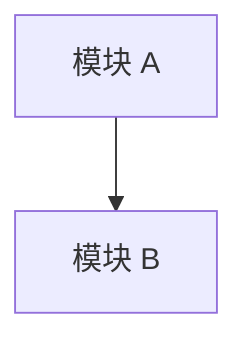

# 04 Repowiki Style / 知识库与 repowiki 风格

Use this module when creating, aligning, or reviewing human-facing `Docs/` or repowiki-style knowledge bases.

## Section index

This module is long. Jump directly to the section you need; do not read top-to-bottom unless auditing the whole module.

Skill-internal rules:

- §Output location — where new docs go (`Docs/` vs `Docs/repowiki/zh/content/`).
- §Memory sync after docs generation — short pointer; full rule in 07.
- §Incremental alignment strategy — align existing docs without rewriting.
- §Common repowiki content tree — default topic tree per project type.
- §Project-type repowiki presets — verified vs not-applicable topics per stack.
- §Preferred repowiki style — Chinese topic-encyclopedia style, citation discipline, multi-branch toolchain rules.
- §Documentation move and rename: index/link sync — pre-move discovery, execution, post-move verification, redirects.
- §Token-saving design rules — index size, narrow-reading defaults.
- §AI Agent index — required structure and Chinese template body for `AI-Agent索引.md`.
- §Add `AI Agent 使用建议` to canonical docs — usage-note block template (4 example variants).
- §Repowiki-style document template — full Chinese topic-doc template body to copy into project docs.

Chinese template bodies (copy-into-project content, not skill rules) live in the second half of the file: `## 目录`, `## 简介`, `## 项目结构`, `## 核心组件`, `## 架构总览`, etc.

## Output location

Newly created project knowledge-base documents default to `Docs/` at the project root.

If the project already has an established canonical docs tree and the user asks to align existing docs rather than migrate or create a new knowledge base, propose a plan before changing the output location.

When the user asks for “repowiki”, “类似当前项目 repowiki”, “中文专题百科”, or a full source-backed wiki, default to this structure:

```text
Docs/repowiki/zh/content/
```

Use project-root `Docs/` for concise project docs and Agent instructions, and `Docs/repowiki/zh/content/` for larger repowiki-style topic encyclopedias.

Recommended split:

- `Docs/AI-Agent索引.md` — optional short top-level pointer for Agents when the user wants a root Docs entrypoint.
- `Docs/AI-MEMORY.md` — memory policy when requested.
- `Docs/repowiki/zh/content/AI-Agent索引.md` — main repowiki Agent navigation entrypoint.
- `Docs/repowiki/zh/content/<topic>/...` — source-backed topic encyclopedia docs.

Do not create a new `.qoder/repowiki/`, lowercase `docs/`, or `wiki/` output tree unless the user explicitly requests that legacy location.

If the project has no docs and the user does not ask for a full repowiki, create a small root `Docs/` tree first. Good options:

- `Docs/README.md`
- `Docs/AI-Agent索引.md`
- `Docs/项目概述.md`
- `Docs/开发者指南.md`

If the project already has generated repowiki elsewhere, treat it as an input/source to inspect or migrate. Preserve its encyclopedia style when useful, but write aligned output into root `Docs/repowiki/zh/content/` by default.

## Memory sync after docs generation

After generating/aligning docs, sync a lightweight pointer (canonical Agent entrypoint + knowledge-base location + optional dev-guide path + freshness reminder) to the target project's memory. Verify memory scope first; skip and report if unavailable or ambiguous.

Full rules, body templates, and skip-condition wording: see `modules/07-memory-policy.md`.

## Incremental alignment strategy

When a project already has docs, wiki, or repowiki content, prefer incremental alignment over broad rewrites:

1. Inventory existing docs and classify them:
   - canonical docs worth preserving
   - generated/background docs useful as secondary context
   - stale docs that need correction
   - duplicate docs that should be linked or consolidated
   - obsolete docs that should only be removed with explicit user approval
2. Identify source-backed corrections before editing prose.
3. Add an AI Agent index or usage notes first if the wiki is large.
4. Update narrow sections that are wrong, risky, or high-impact.
5. Preserve diagrams, troubleshooting notes, domain explanations, and human-readable context when still useful.
6. Mark uncertain claims conservatively instead of inventing missing source evidence.
7. Do not delete or relocate legacy docs unless the user explicitly asks for cleanup or migration.

## Common repowiki content tree

Only create docs and directories that match real project evidence and user goals. For absent domains, prefer a short note in the fact inventory over a fake canonical document.

Default full repowiki output root:

```text
Docs/repowiki/zh/content/
```

Common top-level files:

- `AI-Agent索引.md` — Agent task navigation and source verification entrypoint.
- `快速开始.md` — real install/start/build/test commands, or missing-command warnings.
- `开发者指南.md` — human + Agent development workflow.
- `项目概述.md` — project purpose, shape, verified boundaries; may also be a directory `项目概述/` with sub-files such as `项目介绍.md`, `项目架构概览.md`, `技术栈概览.md`, `快速开始.md` for larger projects.
- `核心功能模块.md` — major user/business capabilities when source-confirmed.
- `测试策略.md` — real test/lint/typecheck state; scaffold or absent tests must be marked.
- `维护和升级.md` — maintenance boundaries, upgrade/runtime/dependency guidance.

Common topic directories, selected by project facts:

| Directory | Create when source/config confirms |
| --- | --- |
| `架构设计/` | cross-cutting architecture, app/server/package boundaries, runtime flow |
| `前端架构/` | frontend app entrypoints, routing, rendering, layouts, client build |
| `后端服务/` | server entrypoint, routes/controllers/services, middleware, jobs |
| `API服务层/` | API clients, service layer, endpoint maps, contracts, generated clients |
| `接口契约/` | OpenAPI/GraphQL/protobuf/schema/types/contracts exist |
| `数据与存储/` | DB schema, migrations, ORM, cache, persistence, object storage |
| `路由系统/` | frontend routes, backend routes, guards, navigation, URL dispatch |
| `状态管理/` | frontend store, server state, cache/session state, persistence |
| `组件系统/` | reusable UI/component system, shared views, design components |
| `插件系统/` | plugin runtime, extension points, middleware, interceptors, custom framework glue |
| `构建和部署/` | package scripts, bundlers, build configs, deploy/release scripts |
| `CI-CD与发布/` | workflow files, release pipelines, artifact publishing, rollback path |
| `部署与运维/` | infra, envs, runbooks, health checks, operational procedures |
| `监控与故障排查/` | logs, metrics, tracing, alerts, error reporting, dashboards, runbooks |
| `移动端适配/` | Android/iOS/Cordova/Capacitor/React Native/Flutter/mobile web evidence |
| `小程序适配/` | mini-program config, app/page routing, platform APIs |
| `安全考虑/` | auth, authorization, token/session, encryption, secrets, privacy handling |
| `第三方集成/` | SDKs, payment, map, analytics, auth providers, external service integrations |
| `样式和UI设计/` | styling system, theme, design tokens, layout conventions, responsive/mobile UI |
| `性能优化/` | cache, lazy loading, bundle/runtime/db/query/network performance evidence |
| `任务队列与异步处理/` | queues, workers, cron, schedulers, async pipelines |
| `配置与环境/` | env files, config loading, feature flags, runtime config boundaries |
| `包与模块边界/` | monorepo packages, libraries, exports, ownership boundaries |

Do not generate the whole directory set by default. Generate the smallest complete tree for the actual project type and user goal.

### Topic gateway + nested subtopic pattern

For medium/large repowikis, prefer a hierarchical layout where each topic directory has a canonical gateway doc plus sibling subtopic docs, and can nest a second level of subtopic directories with their own gateway doc.

```text
<topic>/
├── <topic>.md                   # canonical gateway for the topic
├── <subtopic>.md                # flat subtopic doc
└── <nested-group>/
    ├── <nested-group>.md        # gateway for nested group
    └── <nested-leaf>.md         # leaf subtopic
```

Examples from real source-backed repowiki output:

- `插件系统/插件系统.md` + `插件系统/路由插件.md` + `插件系统/服务插件/服务插件.md`
- `API服务层/API服务层.md` + `API服务层/HTTP请求处理.md` + `API服务层/API接口设计/API接口设计.md`
- `状态管理/状态管理.md` + `状态管理/Store设计与结构.md` + `状态管理/Actions与Mutations/...md`
- `路由系统/路由系统.md` + `路由系统/导航守卫.md` + `路由系统/路由规则/...md`

Rules:

- The gateway doc (`<topic>/<topic>.md`) is the canonical entrypoint and should follow the full repowiki-style document template.
- Sibling subtopic docs may use a lighter version of the same template; they must still cite source.
- Only nest a second level when the gateway doc would otherwise become unreadable or when the subdomain has its own clear evidence boundary.
- Do not nest empty placeholder directories.

## Project-type repowiki presets

Use these presets as starting points, then add/remove topics based on inspected evidence.

### Frontend SPA

```text
Docs/repowiki/zh/content/
├── AI-Agent索引.md
├── 快速开始.md
├── 开发者指南.md
├── 项目概述.md
├── 架构设计/
├── 前端架构/
├── 路由系统/
├── 状态管理/
├── 组件系统/
├── 样式和UI设计/
├── API服务层/
├── 构建和部署/
├── 安全考虑/
└── 性能优化/
```

Add `移动端适配/`, `第三方集成/`, `测试策略.md`, or `监控与故障排查/` only when source/config confirms them.

### Backend service

```text
Docs/repowiki/zh/content/
├── AI-Agent索引.md
├── 快速开始.md
├── 开发者指南.md
├── 项目概述.md
├── 架构设计/
├── 后端服务/
├── API服务层/
├── 接口契约/
├── 数据与存储/
├── 配置与环境/
├── 构建和部署/
├── 安全考虑/
├── 测试策略.md
└── 维护和升级.md
```

Add `任务队列与异步处理/`, `CI-CD与发布/`, `部署与运维/`, `监控与故障排查/`, `第三方集成/`, or `性能优化/` only when verified.

### Other presets (compact matrix)

For the remaining project types, use this matrix instead of full directory trees. All presets share the common top-level files (`AI-Agent索引.md`, `快速开始.md`, `开发者指南.md`, `项目概述.md`, `架构设计/`); add the topic columns below.

| Project type | Required additional topics | Add when evidence supports |
| --- | --- | --- |
| Full-stack web | `核心功能模块.md`, `前端架构/`, `后端服务/`, `API服务层/`, `接口契约/`, `数据与存储/`, `路由系统/`, `状态管理/`, `组件系统/`, `构建和部署/`, `安全考虑/`, `测试策略.md`, `维护和升级.md` | `部署与运维/`, `监控与故障排查/`, `第三方集成/`, `性能优化/`, `移动端适配/`, `任务队列与异步处理/` |
| Mobile / hybrid app | `核心功能模块.md`, `移动端适配/`, `路由系统/`, `状态管理/`, `组件系统/`, `API服务层/`, `第三方集成/`, `构建和部署/`, `安全考虑/`, `性能优化/`, `维护和升级.md` | `前端架构/`, `样式和UI设计/`, `测试策略.md`, `CI-CD与发布/`, `监控与故障排查/` |
| Mini Program | `小程序适配/`, `路由系统/`, `状态管理/`, `组件系统/`, `API服务层/`, `构建和部署/`, `安全考虑/`, `维护和升级.md` | `第三方集成/`, `性能优化/`, `测试策略.md` |
| Monorepo | `包与模块边界/`, `构建和部署/`, `CI-CD与发布/`, `测试策略.md`, `维护和升级.md` | per-app: `前端架构/`, `后端服务/`, `API服务层/`, `数据与存储/`, `移动端适配/` based on packages |
| Infra / DevOps | `配置与环境/`, `构建和部署/`, `CI-CD与发布/`, `部署与运维/`, `监控与故障排查/`, `安全考虑/`, `维护和升级.md` | `第三方集成/`, `性能优化/` |
| Library / package | `包与模块边界/`, `API服务层/`, `构建和部署/`, `测试策略.md`, `性能优化/`, `维护和升级.md` | `CI-CD与发布/`, `安全考虑/` |

For all presets:

- The preset is a scaffold, not a mandate.
- Remove topics without evidence.
- Rename topics to match project language/domain when useful.
- Prefer `未发现/未确认` notes in `AI-Agent索引.md` or the fact inventory over empty directories.
- If the user explicitly wants the dominos-mobile-like shape, use the closest preset and preserve topic names such as `移动端适配`, `项目概述`, `路由系统`, `快速开始.md`, `状态管理`, `插件系统`, `构建和部署`, `开发者指南.md`, `API服务层`, `安全考虑`, `第三方集成`, `架构设计`, `核心功能模块.md`, `样式和UI设计`, `组件系统`, `性能优化`, `测试策略.md`, and `维护和升级.md` when supported by evidence.

## Preferred repowiki style

When the user asks to generate “similar repowiki”, “同样的 repowiki”, or reusable project wiki output, default to the source-backed topic-wiki structure used by the dominos-mobile project.

Use Chinese repowiki style when the user asks for Chinese/dominos-mobile-like output, when existing project docs are primarily Chinese, or when the target team convention is Chinese. Otherwise preserve the target project's dominant documentation language while keeping the same source-backed, topic-wiki, Agent-navigation structure.

- Organize content as a topic encyclopedia, not a single README or linear tutorial.
- Use a top-level AI Agent navigation layer plus canonical topic documents.
- Keep human-readable explanatory sections, diagrams, troubleshooting, conclusions, and appendices.
- Add `## AI Agent 使用建议` near the top of each canonical topic document.
- Start topic documents with a `<cite>` block listing exact source files used.
- After diagrams or important sections, add `图表来源` and/or `章节来源` with `file://...#Lx-Ly` links when line ranges are available. Treat this as the default density: every Mermaid block should carry 图表来源, and every second-level section should close with 章节来源 when source evidence exists.
- Use Mermaid diagrams for module relationships, runtime flows, class/store/API shapes, and decision branches, but only when backed by current source. Prefer a mix of `graph` (module/dependency map), `sequenceDiagram` (runtime flow), `flowchart` (branching logic), and `classDiagram` (store/API/class shape) rather than a single diagram type.
- Mermaid node labels may use two-line form (e.g. `A["main.js<br/>应用入口"]`) for module/file nodes to keep diagrams readable without inflating node count.
- Prefer task-oriented wording: what to read first, which source files to verify, which commands are real, and what common assumptions are unsafe.
- Use conservative claims: distinguish source-confirmed behavior from assumptions, stale docs, or partially verified behavior.

A strong repowiki output serves three readers at once:

1. Humans who need encyclopedia-style background and diagrams.
2. AI Agents who need task routing and source verification guidance.
3. Maintainers who need evidence, risk notes, and troubleshooting entrypoints.

### Citation discipline

Concrete facts must carry line-range citations. Vague references are not acceptable for verifiable claims.

> Pairs with `modules/01-core-principles.md` §Evidence citation levels: 01 defines the abstract levels (file-level / line-level / partial), this section defines the strict claim-type-to-citation-form mapping for repowiki-style output.

| Claim type | Required citation form |
| --- | --- |
| Command, npm script, CLI invocation | `file://package.json#Lx-Ly` (the actual script line) |
| Exported function, class, store, route rule | `file://path#Lx-Ly` covering the definition |
| Hardcoded value, version number, env-specific constant | `file://path#Lx-Ly` for the literal |
| Conditional/branching behavior | `file://path#Lx-Ly` for the branch |
| General module responsibility, directory overview | file-only `file://path` acceptable |
| Cross-cutting flow described in prose | file-only acceptable, plus line ranges for any specific step cited |

Rules:

- Never cite a file you have not actually opened in this session. Every entry inside a `<cite>` block must trace to an actual Read call.
- If line ranges are unknown, either open the file and find them, or mark the claim `[partially-verified]` / `[docs-only]` and avoid stating it as fact.
- Do not invent line numbers from memory; line numbers shift across versions.
- When the same fact appears in multiple files (e.g., a value declared in env and consumed in source), cite the declaration site, not the consumer.

### Multi-branch toolchain disambiguation

Many projects have more than one runtime/toolchain branch. Common patterns:

- Different Node versions for dev vs packaging (e.g., dev uses Node 14, App Store packaging uses Node 20).
- Different build modes producing different artifacts (web, Cordova, hybrid, mini-program).
- Different env files per environment (`dev`, `fun`/UAT, `pro`).
- Different commands for hot-update vs full-release artifacts.

Rules when documenting:

- Never write "the project uses Node X" without checking every relevant script. Inspect `package.json`, packaging shell scripts, CI workflows, and any `.nvmrc` / engines field.
- When toolchain branches diverge, list each branch with its command anchor and runtime expectation in a small table.
- Mark which branch is the default development path and which are special-purpose.
- For env-conditional behavior, cite the env file and the consuming code together.

Example pattern (adapt to project facts):

```md
| Branch | Runtime | Anchor command | Purpose |
| --- | --- | --- | --- |
| Dev/web | Node 14.x | `npm run server` | local development |
| App Store packaging | Node 20.x | `npm run create-pro12-appStore-apk` | release packaging |
```

## Documentation move and rename: index/link sync

Moving, renaming, splitting, or merging an existing doc breaks any reference that still points at the old path or section anchor. Treat path changes as a small-but-strict checklist task, not a free-form edit.

> Review form: `modules/06-review-checklists.md` §Documentation reorganization checklist.

### When this applies

- A file under `Docs/`, `Docs/repowiki/zh/content/`, or a legacy wiki tree is moved or renamed.
- A canonical doc is split into subtopics, or several subtopics are merged.
- A category directory is added/renamed (e.g., reorganizing flat topics into functional groups).
- A section heading inside a referenced doc is renamed (anchor changes).
- `CLAUDE.md` / `AGENTS.md` / `AI-MEMORY.md` references a doc whose path or name will change.

Single-file content edits that do **not** change the path or stable section anchors are out of scope.

### Pre-move discovery

Before moving anything, enumerate everything that points at the old location:

1. Grep the project for the old filename, the old path (relative and absolute as written), and any section anchor referenced from elsewhere.
2. List explicit reference surfaces in priority order:
   - canonical Agent index (`Docs/AI-Agent索引.md` and/or `Docs/repowiki/zh/content/AI-Agent索引.md`)
   - canonical and subtopic docs that link to the moved doc
   - `CLAUDE.md`, `AGENTS.md`, `README.md`, `Docs/README.md`
   - `AI-MEMORY.md` and any project memory pointer
   - source-code citations or comments that link the doc (rare but real)
3. If 5+ surfaces reference the doc, treat the move as a multi-file change and produce a short plan before executing.

### Execution rules

- **Prefer preserving filename and stable anchor**. Move within the tree first; rename only when the new name is clearly better. A rename multiplies the reference-update surface.
- **Preserve original numeric prefixes** when relocating numbered topics; renumbering is a separate decision that requires its own plan.
- **Use relative paths** for cross-doc links inside `Docs/` (e.g., `../canonical/路由系统.md`); reserve absolute-from-repo-root paths for tooling that requires them.
- **Update the index first, then leaf docs**. The Agent index is the single most read surface; fixing it first keeps navigation functional even before all leaves are corrected.
- **Update memory last**, only after the new path is final and verified. Memory pointers should never link to a draft path.

### Post-move verification

After the move, verify the sync is complete:

1. Grep the entire project for the **old** filename and old path — there should be zero matches.
2. Grep for the **new** filename — every reference should resolve to an existing file.
3. Open each updated reference and confirm the link renders correctly (path + anchor).
4. Re-check the canonical Agent index task routes still point at valid files.
5. If `CLAUDE.md` task-oriented entrypoints reference the moved doc, confirm the row was updated.
6. If memory holds a pointer to the doc, confirm the pointer text matches the new path.

### Stragglers, redirects, and deletions

- If a doc is renamed and external references (e.g., older PRs, internal wikis, chat messages) may still point at the old name, leave a one-line redirect note at the old path or in a "Renamed/moved docs" appendix in the index — do not silently break links.
- If a doc is genuinely retired (not replaced), record it in `Docs/AI-Agent索引.md` under a short "Retired docs" line so future Agents do not waste tokens hunting for it.
- Never preserve a stale path simply because some old reference still uses it; fix the reference instead.

### Memory sync after path changes

When the moved doc was the target of a memory pointer:

- Update only the path/name in the existing memory entry; keep the **Why / How to apply** lines unchanged unless the doc's purpose actually changed.
- Do not create a new memory entry for the rename — that produces drift.
- If memory is unavailable, note in the done statement that the doc moved and memory sync is pending.

See `modules/07-memory-policy.md` §Scope verification for the pre-write memory check, and 06 §Documentation reorganization checklist for the final review.

## Token-saving design rules

Design large knowledge bases so future Agents can answer most tasks without loading the whole wiki.

- Keep the canonical Agent index short, task-oriented, and free of copied wiki body text.
- Put the smallest useful source entrypoints near the top of each canonical doc.
- Structure navigation as: index -> canonical doc -> subtopic doc -> source file.
- Avoid repeating the same long architecture explanation across many docs; link to the canonical topic instead.
- Add quick-reference tables for common tasks, commands, high-impact files, and verification paths.
- Separate “AI quick path” from “human background reading” in long documents when helpful.
- Prefer narrow citations and source pointers over large pasted excerpts.
- Sync only the top-level documentation entrypoint to memory so future Agents know where to start without storing the wiki body in memory.

## AI Agent index

If the wiki or docs are large, add an AI Agent navigation file at the canonical knowledge-base entrypoint.

Recommended location and names:

- Full repowiki-style output: use `Docs/repowiki/zh/content/AI-Agent索引.md` as the canonical Agent index.
- Lightweight project docs without full repowiki: use `Docs/AI-Agent索引.md` at the project root.
- Optional root pointer: when full repowiki exists, `Docs/AI-Agent索引.md` may be a short pointer to `Docs/repowiki/zh/content/AI-Agent索引.md` if the user wants a root Docs entrypoint.
- Alternative names only if requested: `Docs/AI Agent Index.md` or `Docs/AGENT_INDEX.md`.
- Existing `.qoder/repowiki/<lang>/content/AI-Agent索引.md`, `docs/AI-Agent索引.md`, or `wiki/**` may be read as legacy sources, but do not create new output there unless explicitly requested.

Recommended structure:

```md
# AI Agent索引

本文是项目知识库面向 AI Agent 的任务导航层，用于在保留人类知识库/自动生成百科结构的同时，帮助 Agent 更快找到相关背景、源码入口和验证重点。

## 使用原则

- 项目知识库用于导航和背景理解，不替代源码、构建配置或项目级 Agent 指令。
- 遇到文档与当前源码不一致时，以源码和真实配置为准。
- 修改功能前先按任务类型进入对应 canonical 文档，再阅读相关源码。
- 优先做局部、可验证的改动，避免仅凭百科描述进行跨模块重构。
- 不要假设存在配置文件未声明的脚本或能力。

## 任务入口速查

| 任务 | 首选文档 | 继续阅读 |
| --- | --- | --- |
| 新人启动/环境确认 | `快速开始.md` | `开发者指南.md` |
| 理解整体架构 | `项目架构概览.md` | canonical 架构专题 |
| 新增或调整页面/路由 | 路由专题 | 页面缓存/导航专题 |
| 新增或调整 API | API 服务层专题 | HTTP/环境配置专题 |
| 新增或调整状态管理 | Store 设计专题 | 状态持久化/模块化专题 |
| 新增或复用组件 | 组件系统专题 | UI/样式专题 |
| 调整插件或运行时能力 | 插件系统专题 | 对应插件专题 |
| 修改后端接口 | 后端服务/API 服务层专题 | 接口契约/数据存储专题 |
| 修改数据库或持久化 | 数据与存储专题 | migration/缓存/回滚说明 |
| 增加或修复测试 | 测试规范专题 | 真实测试脚本/fixture/mock |
| 修改 CI/CD | CI-CD与发布专题 | workflow/脚本/环境变量 |
| 发布、部署或回滚 | 部署与运维专题 | 构建产物/发布脚本/回滚路径 |
| 排查线上错误 | 监控与故障排查专题 | 日志/指标/错误上报/健康检查 |
| 安全、权限或隐私改动 | 安全与隐私规范专题 | 鉴权/权限/密钥/敏感数据处理 |
| 依赖升级或运行时升级 | 开发者指南/构建部署专题 | lockfile/兼容性/验证命令 |
| 调整埋点/追踪 | 追踪分析专题 | 第三方集成专题 |
| 调整移动端/原生能力 | 移动端适配专题 | 打包/原生桥接专题 |

## 常见开发任务路线

可选段落。当任务在表格中信息密度不足时，在 AI-Agent索引 内补一组 numbered 路线，每条 3-5 步，直接给出"先读什么、确认什么、调用什么、验证什么"。示例：

```md
### 新增或调整页面

1. 阅读路由 canonical 文档，确认路由规则来源、模式与 sourcePath 解析。
2. 查找相邻业务页面源码，沿用同域目录、布局、缓存策略。
3. 涉及接口或状态时，进入 API 服务层与状态管理专题确认归属。
4. 使用真实启动命令做本地验证，并关注多环境/原生壳差异。
```

仅在确有任务可总结时加入；不要堆砌空泛模板。

## 验证与风险提示

- 当前启动、构建、测试、lint 命令必须以真实配置为准。
- 文档变更应检查链接、标题和命令表述。
- 代码变更必须回到源码和真实命令验证。
- 高影响区域应最小范围修改并明确验证方式。
```

## Add `AI Agent 使用建议` to canonical docs

For each canonical topic doc, add a short `## AI Agent 使用建议` section near the top. Usually 4–6 bullets.

### Principles (apply to every topic)

- Lead with "before changing X, read Y" — task-oriented, not descriptive.
- State the smallest source entrypoint(s) the Agent must verify before acting.
- Call out the most common unsafe assumption for this topic.
- End with "source files / configs are authoritative — docs are background."
- Do not duplicate index-level task routing; keep these bullets topic-local.
- Do not exceed ~6 bullets; longer guidance belongs in `Docs/AI-Agent开发指南.md`.

### Reference examples (adapt wording to project)

Pick the closest example for each canonical doc, then rewrite with real source paths.

#### Architecture / overview

```md
## AI Agent 使用建议

- 本文是理解全局架构的 canonical 入口；修改跨模块行为前先用它确认入口/路由/服务/状态/构建的关系。
- 仅凭架构图不要做代码修改；具体实现请进入对应专题文档和源码。
- 入口和注册点以 `<entry-file>` 和插件注册文件为准。
```

#### Routing / API / state / component (structural topics)

```md
## AI Agent 使用建议

- 修改本主题前先读对应配置/注册文件，再查相邻业务实现复用模式。
- 同步检查影响面：路由→缓存/守卫；API→签名/headers；状态→持久化/清理；组件→全局注册/样式作用域。
- 不要绕过项目既有封装（统一服务层、统一 store 模式、统一 layout）。
- 行为以源码和实际调用方为准。
```

#### Build / deploy / native / hybrid

```md
## AI Agent 使用建议

- 修改构建/打包/原生能力前，先阅读本文与 `package.json` scripts 及 CI 配置。
- 多 runtime 分支可能并存（如 dev 与打包脚本使用不同 Node 版本），命令必须以真实脚本为准。
- 不要假设未在配置中声明的 lint/test/build 脚本存在。
- 真实行为以 build/config/CI/原生桥接源码为准。
```

#### Tracking / security / cross-cutting infrastructure

```md
## AI Agent 使用建议

- 修改本主题前先确认触发时机、注册点和生命周期，再查找已有实现避免重复或绕过。
- 涉及路由元信息、鉴权边界、敏感数据或第三方集成时，跨文档同步检查影响面。
- 不要弱化既有鉴权/校验/采集逻辑；新增能力优先复用现有插件或中间件。
- 实际行为以插件/中间件源码与运行环境判断为准。
```

## Repowiki-style document template

Use this structure for a Chinese source-backed encyclopedia page.

Standard section names are below; the following local variants are equivalent and may be used to match existing docs or domain conventions:

| 标准命名 | 可接受变体 |
| --- | --- |
| 简介 | 引言 |
| 详细组件分析 | 组件详解 |
| 依赖关系分析 | 依赖分析 |
| 性能考量 | 性能考虑 / 性能注意事项 / 性能与缓存策略 |
| 故障排查指南 | 故障排除指南 |

Domain-specific sections may be inserted between 详细组件分析 and 故障排查指南 when source evidence supports them, for example:

- `## 安全与鉴权` — for API/service/auth canonical docs
- `## 测试与模拟数据` — for API/service docs that document fixture/mock conventions
- `## 缓存策略` — for state/API performance canonical docs

Keep the section order stable across docs so the index → canonical doc → subtopic doc navigation reads consistently.


````md
# 标题

> 最后基于源码核对：YYYY-MM-DD（commit 短哈希）

<cite>
**本文引用的文件**
- [file](file://path/to/file)
</cite>

## 目录

1. [简介](#简介)
2. [AI Agent 使用建议](#ai-agent-使用建议)
3. [权威来源与事实边界](#权威来源与事实边界)
4. [未发现/未确认](#未发现未确认)
5. [文档新鲜度](#文档新鲜度)
6. [项目结构](#项目结构)
7. [核心组件](#核心组件)
8. [架构总览](#架构总览)
9. [详细组件分析](#详细组件分析)
10. [依赖关系分析](#依赖关系分析)
11. [性能考量](#性能考量)
12. [故障排查指南](#故障排查指南)
13. [结论](#结论)
14. [附录](#附录)

## 简介

说明本文面向谁、解决什么问题、覆盖哪些主题。

## AI Agent 使用建议

- 给 Agent 的任务入口建议。
- 修改前先读什么。
- 需要验证哪些源码。
- 常见误区是什么。

## 权威来源与事实边界

- 本文哪些结论来自源码。
- 哪些结论来自配置、脚本、CI 或运行入口。
- 哪些只来自现有文档或生成 wiki，尚未源码确认。
- 哪些能力当前项目未发现证据，不应默认存在。

## 未发现/未确认

明确列出本主题下未在当前源码/配置中发现证据、或仅部分发现的能力，避免读者默认存在：

- 未发现：列出本应在该领域出现但本次检查未找到的能力（如该项目无后端测试、无 CI 工作流、无 lint 脚本）。
- 部分确认：列出存在但未经运行时验证的能力（如脚本存在但未执行、依赖存在但未确认调用点）。
- 未在本次检查范围内：列出与主题相关但本次未读取的目录或文件，注明需要后续验证。

不要为"未发现"项目编造规范或补充模板内容。

## 文档新鲜度

- 哪些源码、配置、脚本、接口、部署链路变化后需要复核本文。
- 哪些命令、测试状态、CI/CD、运维、监控或安全结论最容易过时。
- 如果最近未复核，应如何保守描述。

## 项目结构

列出相关目录和职责。



图表来源
- [source](file://source#L1-L10)

章节来源
- [source](file://source#L1-L10)

## 核心组件

用 bullet 总结核心模块、职责、边界。

## 架构总览

用简短文字和图说明整体流程。

## 详细组件分析

按组件/模块逐个说明：
- 职责
- 输入输出
- 生命周期
- 与其它模块关系
- 关键源码位置

## 依赖关系分析

说明内部依赖、外部依赖、配置依赖、运行时依赖。

## 性能考量

只写当前项目真实相关的性能点，不泛泛而谈。

## 故障排查指南

列出常见问题、现象、排查入口。

## 结论

总结当前真实架构和后续维护建议。

## 附录

命令、配置、接口、字段、路径速查。
````
